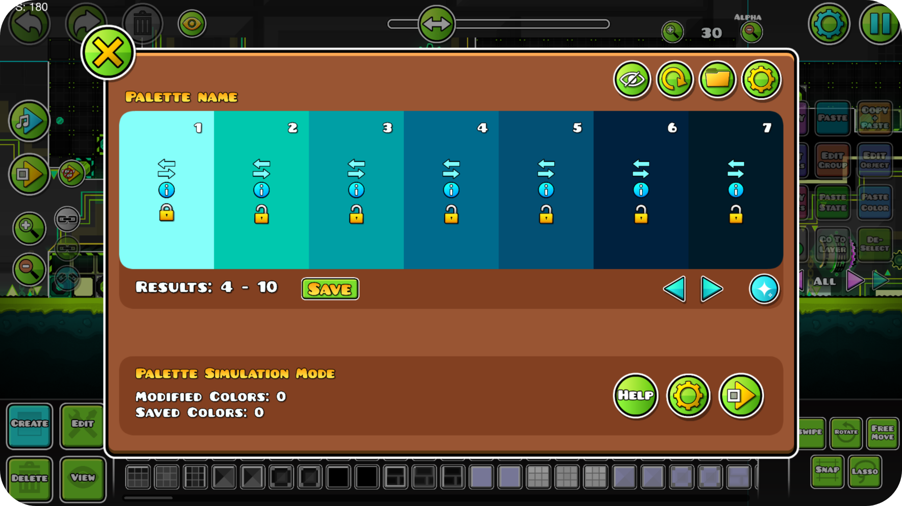
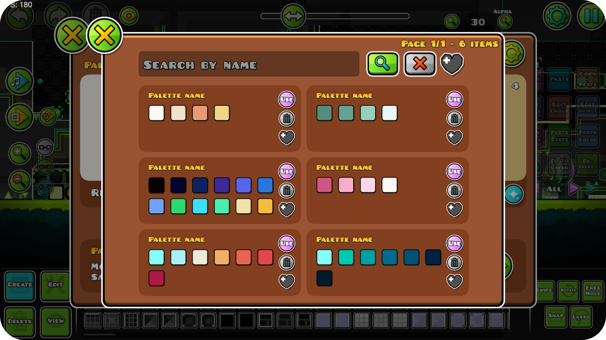
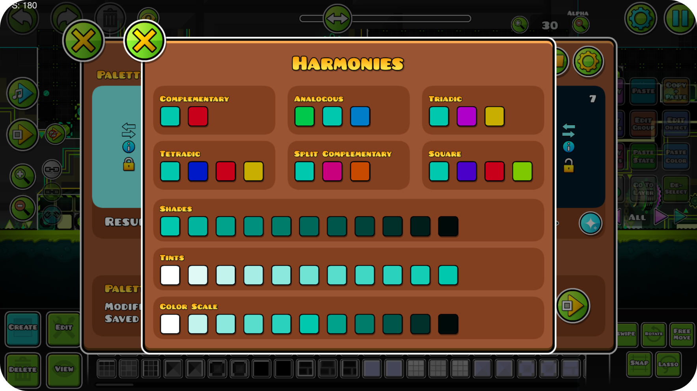

# Harmony


## Features

### Palette Generation
Generate color palettes of up to 12 colors with full control over the generation settings. Choose from different presets, modes, and creativity levels, or fine-tune results using a custom adjacency matrix. Requires an internet connection.

Powered by [Huemint.com](https://huemint.com/) — a machine learning platform built for generating beautiful color palettes for graphic design.



---

### Palette Library
Save your generated palettes for later use. Give them a custom name and mark your favorites to keep your best discoveries organized and easy to find.



---

### Color Harmonies
Explore the color relationships of any color in your palette by clicking its info button. A popup will show you:

- **Complementary, Analogous, Triadic, Tetradic, Split-Complementary and Square** harmonies.
- **Shades, Tints and Color Scales** derived from the selected color.



### Palette Simulation
Preview how a palette looks in your level in real time. Link palette slots to color channels through the settings panel.


## Powered by Huemint
The palette generation in this mod is powered by [Huemint.com](https://huemint.com/), a machine learning platform for generating color palettes for graphic design. This mod uses its public API to generate palettes based on your settings.


## Getting started
We recommend heading over to [the getting started section on our docs](https://docs.geode-sdk.org/getting-started/) for useful info on what to do next.

## Build instructions
For more info, see [our docs](https://docs.geode-sdk.org/getting-started/create-mod#build)
```sh
# Assuming you have the Geode CLI set up already
geode build
```

# Resources
* [Geode SDK Documentation](https://docs.geode-sdk.org/)
* [Geode SDK Source Code](https://github.com/geode-sdk/geode/)
* [Geode CLI](https://github.com/geode-sdk/cli)
* [Bindings](https://github.com/geode-sdk/bindings/)
* [Dev Tools](https://github.com/geode-sdk/DevTools)
